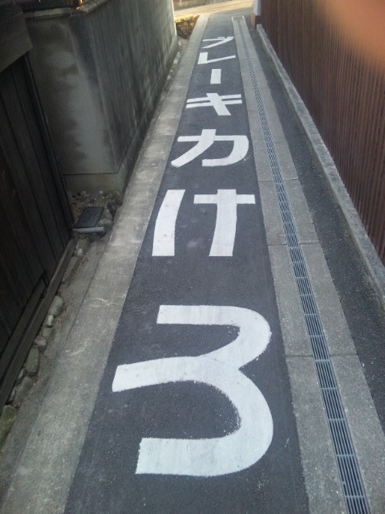
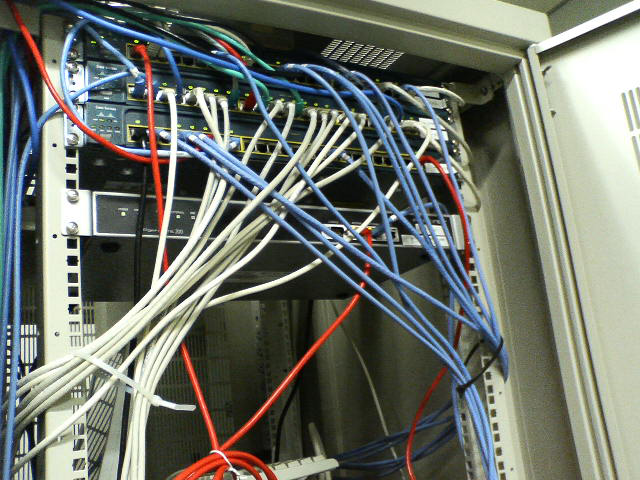
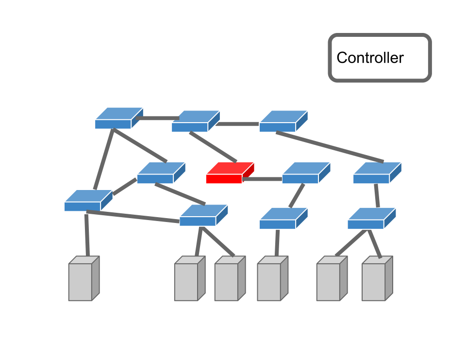

!SLIDE center transition=fade
# Trema Switch

!SLIDE center transition=fade
# 高宮 安仁

!SLIDE center transition=fade

!SLIDE center transition=fade

!SLIDE center transition=fade

!SLIDE center transition=fade

!SLIDE center transition=fade

!SLIDE center transition=fade

!SLIDE center transition=fade

!SLIDE center transition=fade
# @yasuhito

!SLIDE center transition=fade

!SLIDE center transition=fade
# @yasuhito
# 宮坂 部長

!SLIDE center transition=fade
# = 高宮 平社員

!SLIDE center transition=fade

!SLIDE center transition=fade
# 

!SLIDE center transition=fade

!SLIDE center transition=fade

!SLIDE center transition=fade

!SLIDE center transition=fade

!SLIDE center transition=fade

!SLIDE center transition=fade

!SLIDE center transition=fade

!SLIDE center transition=fade

!SLIDE center transition=fade
# 自称

!SLIDE center transition=fade
# 自称 Trema リーダー

!SLIDE center transition=fade

!SLIDE center transition=fade

!SLIDE center transition=fade
# やってること

!SLIDE center transition=fade

!SLIDE center transition=fade

!SLIDE center transition=fade

!SLIDE center transition=fade

!SLIDE center transition=fade
# リリースエンジニアリング

!SLIDE center transition=fade

!SLIDE center transition=fade

!SLIDE center transition=fade
## 他の Trema メンバーを応援

!SLIDE center transition=fade

!SLIDE center transition=fade

!SLIDE center transition=fade

!SLIDE center transition=fade

!SLIDE center transition=fade
# Full Stack

!SLIDE center transition=fade
# ?

!SLIDE center transition=fade

!SLIDE center transition=fade

!SLIDE center transition=fade

!SLIDE center transition=fade

!SLIDE center transition=fade

!SLIDE center transition=fade
# ==

!SLIDE center transition=fade
# lib

!SLIDE center transition=fade

# lib

!SLIDE center transition=fade

!SLIDE center transition=fade

!SLIDE center transition=fade
# Full Stack

!SLIDE center transition=fade
# Full Stack
# =
## Network Emulator
## +
## OpenFlow Library
## +
## trema command

!SLIDE center transition=fade
# Network Emulator

!SLIDE transition=fade

    @@@ ruby
    vswitch { dpid "0xabc" }
    
    vhost("host1")
    vhost("host2")
    vhost("host3")
    
    link "0xabc", "host1"
    link "0xabc", "host2"
    link "0xabc", "host3"

!SLIDE center transition=fade

!SLIDE center transition=fade

!SLIDE center transition=fade

!SLIDE center transition=fade

!SLIDE center transition=fade

!SLIDE center transition=fade

!SLIDE center transition=fade

!SLIDE center transition=fade
# 一方、

!SLIDE center transition=fade

!SLIDE transition=fade
    @@@ ruby
    vswitch { dpid "0xabc" }
    
    vhost("host1")
    vhost("host2")
    vhost("host3")
    
    link "0xabc", "host1"
    link "0xabc", "host2"
    link "0xabc", "host3"

!SLIDE transition=fade
    @@@ shell
    % trema send_packets --source host1 \
      --dest host2

!SLIDE transition=fade
    @@@ shell
    % trema show_stats host1

!SLIDE center transition=fade
# Trema 便利

!SLIDE center transition=fade
# 足りない部品

!SLIDE center transition=fade
# ?

!SLIDE center transition=fade
# SDN の世界

!SLIDE center transition=fade

!SLIDE center transition=fade

!SLIDE center transition=fade
## たくさんのスイッチと、
## コントローラが
## 協調して動作する

!SLIDE center transition=fade
## ..しかもそれぞれのステートを変えながら

!SLIDE center transition=fade
# == 分散プログラミング

!SLIDE center transition=fade
## 分散プログラミングできますか？

!SLIDE center transition=fade
## バグの無い分散プログラム

!SLIDE center transition=fade
# Q: フレームワークに
# できることは？

!SLIDE center transition=fade
# 

!SLIDE center transition=fade
# もっと簡単な話

!SLIDE center transition=fade

# トポロジ検知

!SLIDE smaller transition=fade

    @@@ ruby
    class TopologyManager < Controller
      ...
    
      def port_status dpid, message
        case message
          when PortStatusAdd
            ...
          when PortStatusDelete
            ...
          when PortStatusModify
            ...
        end
      end

## ポート情報の変化をトラッキング

!SLIDE center transition=fade
# どうやってテストする？

!SLIDE center transition=fade

## PortStatus メッセージを作って送る

!SLIDE center transition=fade
## Open vSwitch では (たぶん) できない

!SLIDE center transition=fade
# REPL

!SLIDE center transition=fade

!SLIDE center transition=fade
# Read-Eval-Print-Loop

!SLIDE center transition=fade
## PortStatus メッセージを送る
## → ハンドラが動く

!SLIDE center transition=fade
## コマンドラインからひとつひとつ
## 実行しながら確かめたい

!SLIDE center transition=fade
## PortStatus を送るだけのスイッチ

!SLIDE smaller transition=fade

    @@@ ruby
    class PortAddSwitch < Switch
      def features_request xid, message
        super xid, message

        # コントローラの port_status() を起動
        send_message PortStatusAdd.new
      end
    end

!SLIDE center transition=fade
# ソフトウェアテスト

!SLIDE center transition=fade
# テスト専用スイッチ

!SLIDE center transition=fade
## テストの数だけ専用スイッチを作る
* スイッチ A
* スイッチ B
* スイッチ C
* スイッチ D
*  ....

!SLIDE center transition=fade
# テスト専用スイッチ x N

!SLIDE center transition=fade
# 

!SLIDE center transition=fade

!SLIDE center transition=fade
# 新プロジェクト

!SLIDE center transition=fade
# Trema::Switch

!SLIDE center transition=fade
# 例

!SLIDE smaller transition=fade

    @@@ ruby
    class MinimumSwitch < Switch
      def controller_connected
        send_message Hello.new
      end
    
      def features_request xid
        send_message FeaturesReply.new( :dpid => dpid,
                                        :xid => xid )
      end
    end

## コントローラとつながるスイッチ

!SLIDE smaller transition=fade

    @@@ ruby
    class RealMinimumSwitch < Switch; end

## 完全な OpenFlow スイッチが 1 行で!

!SLIDE center transition=fade
## ハンドラをオーバーロードすると
## スイッチの動作を変更できる

!SLIDE smaller transition=fade

    @@@ ruby
    class ErrorSwitch < Switch
      ...
    
      def flow_mod xid, message
        send_message FlowModFailed.new
      end

# エラーインジェクション

!SLIDE center transition=fade
# もうひとつ

!SLIDE center transition=fade

## でかいネットワークのテスト?

!SLIDE center transition=fade
# REPL = 手作業

!SLIDE center transition=fade

!SLIDE center transition=fade
## ユニットテストで自動化

!SLIDE center transition=fade

!SLIDE smaller transition=fade

    @@@ ruby
    before { vhost( "host0" ).send_packets "host3" }
    
    context "when switchx becomes down" do
      let ( :switchx ) { ErrorSwitch.new }

      it { rswitch( "switch0" ) should ... }
      it { rswitch( "switch1" ) should ... }
    end

!SLIDE center transition=fade
## テストのセットアップも
## すべて Ruby で書く

!SLIDE center transition=fade

!SLIDE smaller transition=fade

    @@@ ruby
    before {
      vhost( "host0" ).send_packets "host3"
      send_flow_mod_add(
        dpid,
        :actions => ActionOutput.new( OFPP_FLOOD )
      )
    }

    subject { rswitch( "switch" ) }

    it { should have( 1 ).flows }
    its( "flows.first.actions" ) { should == OFPP_FLOOD }
      ...

!SLIDE center transition=fade
## スイッチの内部状態を
## Ruby オブジェクトとして取得

!SLIDE transition=fade
# 人材募集

!SLIDE center transition=fade

!SLIDE center transition=fade

!SLIDE center transition=fade

!SLIDE transition=fade
* スイッチを書いてみたい人
* テストが好きな人

!SLIDE transition=fade
# Trema コミッタになろう!

!SLIDE center transition=fade

# おわり
