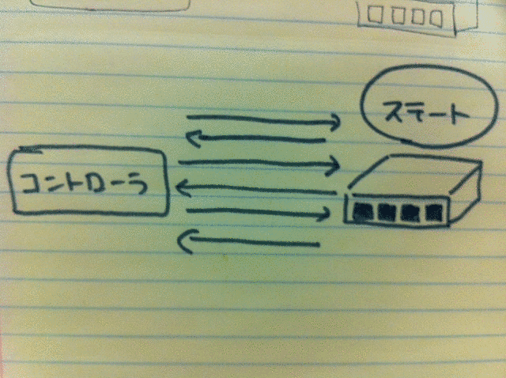

!SLIDE center transition=scrollUp

!SLIDE center transition=fade

!SLIDE center transition=fade

!SLIDE center transition=fade

!SLIDE center transition=fade

!SLIDE center transition=fade

!SLIDE center transition=fade

!SLIDE center transition=fade

!SLIDE center transition=fade

!SLIDE center transition=fade

!SLIDE smaller transition=fade

* スイッチを一度は作ってみたい
* 中身を理解してみたい

!SLIDE center transition=fade

!SLIDE smaller transition=fade

    @@@ ruby
    class MinimumSwitch < Switch
      def controller_connected
        send_message Hello.new
      end
    
      def features_request xid
        send_message FeaturesReply.new( :dpid => dpid,
                                        :xid => xid )
      end
    end

!SLIDE smaller transition=fade

    @@@ ruby
    class RealMinimumSwitch < Switch
    end

!SLIDE smaller transition=fade

    @@@ ruby
    class RealMinimumSwitch < Switch
    end

!SLIDE center transition=fade

!SLIDE center transition=fade

!SLIDE center transition=fade

!SLIDE smaller transition=fade

# エラーインジェクション

!SLIDE smaller transition=fade

    @@@ ruby
    describe "switch" do
      before {
        send_flow_mod_add(
          dpid,
          :actions => ActionOutput.new( OFPP_FLOOD )
        )
      }

      subject { rswitch( "switch" ) }

      it { should have( 1 ).flows }
      its( "flows.first.actions" ) { should == OFPP_FLOOD }
    end

!SLIDE smaller transition=fade

    @@@ ruby
    class ErrorSwitch < Switch
      ...
    
      def flow_mod xid, message
        send_message FlowModFailed.new
      end

!SLIDE smaller transition=fade

    @@@ ruby
    describe MyController do
      before { subject.send_flow_mod dpid }
      
      context "when flow_mod causes an error" do
        let ( :switch ) { ErrorSwitch.new }
        it { should_receive( :openflow_error ).with( FlowModFailed ) }
      end

!SLIDE smaller transition=fade

    @@@ ruby
    class TopologyManager < Controller
      ...
    
      def port_status dpid, message
        case message
          when PortStatusAdd
            ...
          when PortStatusDelete
            ...
          when PortStatusModify
            ...
        end
      end

!SLIDE smaller transition=fade

# ポート状態が変わると何か複雑なことが起こる

!SLIDE smaller transition=fade

# どうやってテストするのこれ

!SLIDE smaller transition=fade

    @@@ ruby
    class PortAddSwitch < Switch
      def features_request xid, message
        # invokes controller's switch_ready()     
        super xid, message

        # invokes controller's port_status()
        send_message PortStatusAdd.new
      end
    end

!SLIDE center transition=fade

!SLIDE center transition=fade

