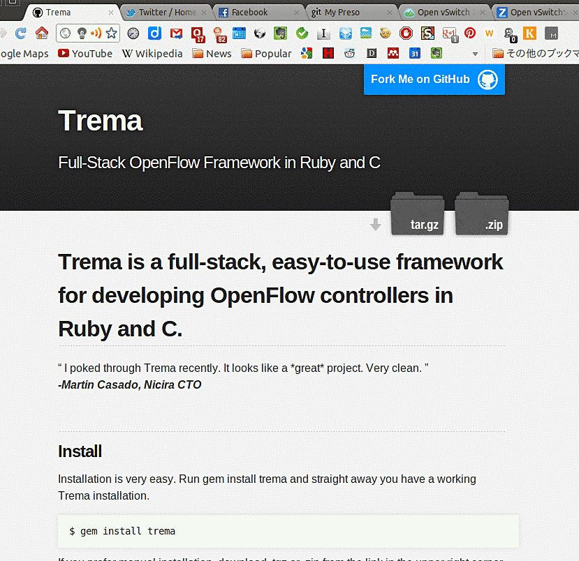

!SLIDE center transition=fade
# Trema のスイッチ

!SLIDE center transition=fade
# 高宮

!SLIDE center transition=fade
# @yasuhito

!SLIDE center transition=fade
# 宮坂部長

!SLIDE center transition=fade

!SLIDE center transition=fade
# = 高宮

!SLIDE center transition=fade

!SLIDE center transition=scrollUp

!SLIDE center transition=fade

!SLIDE center transition=fade

!SLIDE center transition=fade
# (自称)

!SLIDE center transition=fade

!SLIDE center transition=fade

!SLIDE center transition=fade

!SLIDE center transition=fade

!SLIDE center transition=fade

!SLIDE center transition=fade

!SLIDE center transition=fade

!SLIDE center transition=fade

!SLIDE center transition=fade

!SLIDE center transition=fade

!SLIDE center transition=fade
# Full Stack

!SLIDE center transition=fade
# ?

!SLIDE center transition=fade

!SLIDE center transition=fade

!SLIDE center transition=fade

!SLIDE center transition=fade

!SLIDE center transition=fade

!SLIDE center transition=fade
# lib

!SLIDE center transition=fade

!SLIDE center transition=fade
# lib

!SLIDE center transition=fade

!SLIDE center transition=fade

!SLIDE center transition=fade

!SLIDE center transition=fade
# Full Stack

!SLIDE center transition=fade
# Emu

!SLIDE transition=fade

    @@@ ruby
    vswitch("repeater_hub") { dpid "0xabc" }
    
    vhost("host1") { promisc "On" }
    vhost("host2") { promisc "On" }
    vhost("host3") { promisc "On" }
    
    link "repeater_hub", "host1"
    link "repeater_hub", "host2"
    link "repeater_hub", "host3"

!SLIDE center transition=fade
# REPL

!SLIDE center transition=fade
# Read-Eval-Print-Loop

!SLIDE center transition=fade

!SLIDE center transition=fade

!SLIDE center transition=fade

!SLIDE center transition=fade

!SLIDE transition=fade

    @@@ ruby
    vswitch("repeater_hub") { dpid "0xabc" }
    
    vhost("host1") { promisc "On" }
    vhost("host2") { promisc "On" }
    vhost("host3") { promisc "On" }
    
    link "repeater_hub", "host1"
    link "repeater_hub", "host2"
    link "repeater_hub", "host3"

!SLIDE center transition=fade
# 足りない部品

!SLIDE smaller transition=fade

    @@@ ruby
    class TopologyManager < Controller
      ...
    
      def port_status dpid, message
        case message
          when PortStatusAdd
            ...
          when PortStatusDelete
            ...
          when PortStatusModify
            ...
        end
      end

!SLIDE center transition=fade

!SLIDE center transition=fade
# ovs-ofctl

!SLIDE center transition=fade

!SLIDE center transition=fade
# ソフトウェアテスト

!SLIDE center transition=fade
# expectation

!SLIDE center transition=fade
# テスト専用スイッチ

!SLIDE center transition=fade
* スイッチ A
* スイッチ B
* スイッチ C
* スイッチ D
*  ....

!SLIDE center transition=fade
# テスト専用スイッチ

!SLIDE center transition=fade

!SLIDE center transition=fade
# 新製品

!SLIDE center transition=fade
# Switch Class

!SLIDE center transition=fade
# OF スイッチライブラリ

!SLIDE center transition=fade
# 例

!SLIDE smaller transition=fade

    @@@ ruby
    class MinimumSwitch < Switch
      def controller_connected
        send_message Hello.new
      end
    
      def features_request xid
        send_message FeaturesReply.new( :dpid => dpid,
                                        :xid => xid )
      end
    end

!SLIDE smaller transition=fade

    @@@ ruby
    class RealMinimumSwitch < Switch
    end

!SLIDE smaller transition=fade

    @@@ ruby
    class TopologyManager < Controller
      ...
    
      def port_status dpid, message
        case message
          when PortStatusAdd
            ...
          when PortStatusDelete
            ...
          when PortStatusModify
            ...
        end
      end

!SLIDE smaller transition=fade

    @@@ ruby
    class PortAddSwitch < Switch
      def features_request xid, message
        # invokes controller's switch_ready()     
        super xid, message

        # invokes controller's port_status()
        send_message PortStatusAdd.new
      end
    end

!SLIDE center transition=fade

!SLIDE smaller transition=fade

    @@@ ruby
    before {
      send_flow_mod_add(
        dpid,
        :actions => ActionOutput.new( OFPP_FLOOD )
      )
    }

    subject { rswitch( "switch" ) }

    it { should have( 1 ).flows }
    its( "flows.first.actions" ) { should == OFPP_FLOOD }

!SLIDE smaller transition=fade

# エラーインジェクション

!SLIDE smaller transition=fade

    @@@ ruby
    class ErrorSwitch < Switch
      ...
    
      def flow_mod xid, message
        send_message FlowModFailed.new
      end

!SLIDE smaller transition=fade

    @@@ ruby
    describe MyController do
      before { subject.send_flow_mod dpid }
      
      context "when flow_mod causes an error" do
        let ( :switch ) { ErrorSwitch.new }
        it { should_receive( :openflow_error ).with( FlowModFailed ) }
      end

!SLIDE center transition=fade

!SLIDE center transition=fade

!SLIDE center transition=fade

!SLIDE transition=fade
# 人材募集

!SLIDE center transition=fade

!SLIDE center transition=fade

!SLIDE transition=fade
* スイッチを書いてみたい人
* テストが得意な人

!SLIDE transition=fade
# おわり

